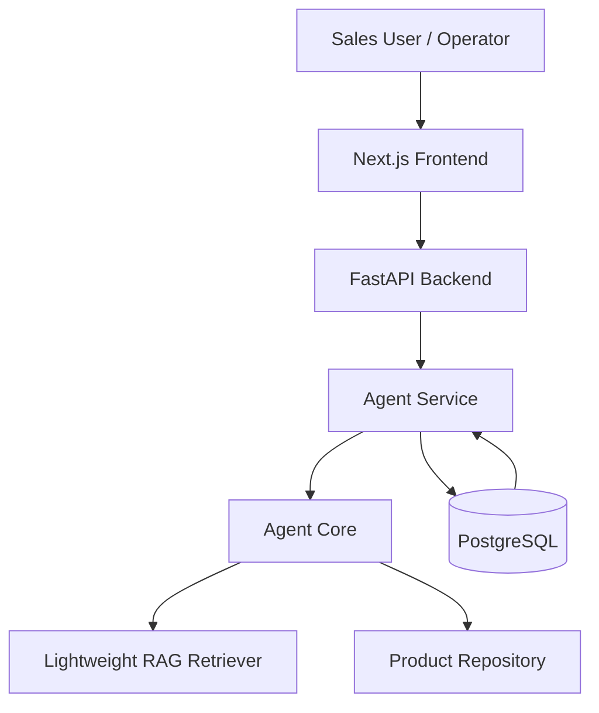
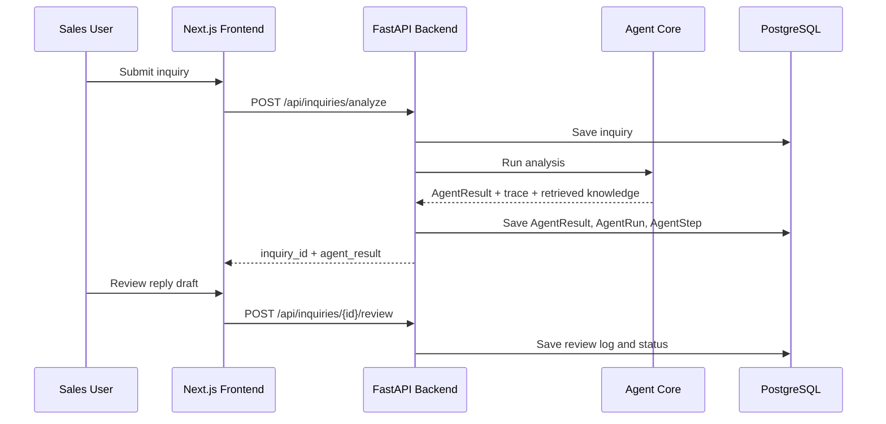

# Industrial Automation Inquiry Agent

面向工业自动化外贸场景的询盘需求确认与转化辅助 Agent。项目用于帮助客服 / 外贸业务员处理官网询盘和邮件询盘，完成产品类别判断、需求参数抽取、知识检索、候选产品推荐、英文回复草稿生成、风险提示与人工审核记录。

当前项目已经完成 A1-A5.6 阶段：`Next.js + FastAPI + Agent Core + PostgreSQL + Docker Compose`，适合作为 GitHub 作品集、简历项目、面试讲解和 3-5 分钟录屏展示。

## 1. 项目概览 Project Overview

Industrial Automation Inquiry Agent 不是自动成交机器人，而是面向 B2B 外贸业务员的内部辅助系统。它将非结构化英文询盘转换为结构化 `AgentResult`，并保留 `Agent Trace` 与 `Retrieved Knowledge`，方便人工复核。

相关文档：

- [系统架构 Architecture](docs/architecture.md)
- [演示脚本 Demo Script](docs/demo_script.md)
- [API 文档 API Overview](docs/api_overview.md)
- [面试讲解 Interview Guide](docs/interview_guide.md)
- [简历描述 Resume Description](docs/resume_description.md)
- [项目总结 Project Summary](docs/project_summary.md)
- [人工复测报告 Manual Test Report](docs/manual_test_report.md)

## 2. 业务场景 Business Scenario

工业自动化外贸询盘通常信息不完整，例如：

- `Need Siemens compatible PLC, 16DI and 8DO, RS485.`
- `Looking for 2.2kW VFD for water pump, 380V three phase.`
- `Need 7 inch HMI with Ethernet and Modbus TCP.`
- `Looking for 8-port gigabit industrial switch, unmanaged is ok.`

业务员需要快速判断：客户想买什么、缺哪些关键参数、有哪些候选产品、应该追问什么，以及回复中有哪些风险不能承诺。

## 3. 核心功能 Key Features

- 官网询盘 Website Inquiry 和邮件询盘 Email Inquiry。
- PLC、VFD、HMI、Industrial Switch 四类产品样例。
- 规则 fallback + 可选 LLM JSON 抽取。
- 结构化 `AgentResult`。
- 产品匹配 `Candidate Products`，包含 `match_score`、`match_reason`、`missing_confirmations`。
- 轻量 RAG 检索，展示 `Retrieved Knowledge` 来源。
- `Agent Trace` 可观测性，展示每个节点的 mode、success、latency。
- 风险提示 `Risk Flags`。
- 英文回复草稿 `English Reply Draft`，必须人工审核。
- PostgreSQL 持久化 inquiry、AgentResult、AgentRun、AgentStep、ReviewLog。
- 中英文 UI 切换，默认中文，支持 `localStorage` 保持用户选择。
- Docker Compose 一键启动。

## 4. 系统架构 Architecture



前端负责业务员工作台展示；后端负责 API、持久化和 Agent 调用；Agent Core 负责意图识别、品类判断、需求抽取、RAG、产品匹配、回复草稿和风险检查。

## 5. 技术栈 Tech Stack

- Frontend: Next.js, TypeScript, Tailwind CSS, App Router
- Backend: FastAPI, Pydantic, SQLAlchemy
- Database: PostgreSQL, SQLite fallback
- Agent Core: rule fallback, optional LLM JSON extraction
- RAG: Markdown loader, splitter, keyword retriever
- DevOps: Docker Compose, Dockerfile, healthcheck
- Testing: pytest, Next.js build

## 6. Agent 工作流 Agent Workflow

```mermaid
flowchart LR
    I["InquiryInput"] --> C["Intent Classifier"]
    C --> K["Product Category Classifier"]
    K --> E["Requirement Extractor"]
    E --> M["Missing Info Checker"]
    M --> R["Knowledge Retriever"]
    R --> P["Product Matcher"]
    P --> D["Reply Draft Generator"]
    D --> X["Risk Checker"]
    X --> O["Structured AgentResult"]
```



每个节点都会记录 `Agent Trace`：

- `step_name`
- `mode`: rule / llm / fallback / retrieval / hybrid
- `input_summary`
- `output_summary`
- `success`
- `error_message`
- `latency_ms`

## 7. 数据流 Data Flow



## 8. 截图 Screenshots

以下截图均来自真实运行的 Docker Compose 环境，截图清单见 [docs/screenshots/README.md](docs/screenshots/README.md)。

### 首页 Dashboard


### 询盘分析 Analyze Form


### AgentResult 结构化结果


### 询盘详情 Inquiry Detail


### 候选产品 Candidate Products


### 检索来源 Retrieved Knowledge


### Agent 执行轨迹 Agent Trace


### 人工审核 Human Review


### Swagger API


## 9. Docker Compose 快速启动 Quick Start

```bash
docker-compose up --build
```

访问地址：

```text
Frontend: http://127.0.0.1:3001
Backend API: http://127.0.0.1:8000
Swagger: http://127.0.0.1:8000/docs
PostgreSQL: localhost:5432
```

停止服务：

```bash
docker-compose down
```

清空数据库 volume：

```bash
docker-compose down -v
```

## 10. 本地开发 Local Development

Backend:

```bash
cd backend
uvicorn app.main:app --reload --port 8000
```

Frontend:

```bash
cd frontend
npm install
npm run dev -- -H 127.0.0.1 -p 3001
```

Backend tests:

```bash
cd backend
PYTHONPATH=. pytest
```

Frontend build:

```bash
cd frontend
npm run build
```

## 11. API 概览 API Overview

- `GET /api/health`
- `POST /api/inquiries/analyze`
- `GET /api/inquiries`
- `GET /api/inquiries/{id}`
- `POST /api/inquiries/{id}/review`
- `GET /api/inquiries/samples`

详细说明见 [docs/api_overview.md](docs/api_overview.md)。

## 12. 演示流程 Demo Workflow

推荐演示流程：

1. 启动 Docker Compose。
2. 打开 `http://127.0.0.1:3001`。
3. 查看 Dashboard 和 backend health。
4. 进入 Analyze Inquiry。
5. 加载 PLC 或 VFD sample。
6. 提交分析并展示 AgentResult。
7. 展示 Candidate Products、Missing Information、Retrieved Knowledge、Agent Trace。
8. 进入 Inquiry Detail。
9. 编辑 English Reply Draft。
10. 提交 Human Review。
11. 查看 Inquiry List 和 PostgreSQL 持久化。

详细脚本见 [docs/demo_script.md](docs/demo_script.md)。

## 13. 原型边界 Prototype Boundary

当前项目是工程化原型，不是生产销售自动化系统。

- 当前产品数据为高仿真模拟数据。
- 当前轻量 RAG 不是最终生产级向量数据库。
- 系统不自动报价。
- 系统不承诺库存。
- 系统不承诺交期。
- 系统不自动发送邮件。
- 英文回复草稿必须由业务员人工审核。
- 登录权限、CRM、ERP、邮件系统、Qdrant、Redis、报价系统尚未接入。
- 当前评估不代表真实生产准确率。

## 14. 路线图 Roadmap

- A6: 使用 Qdrant 替换当前轻量关键词 RAG。
- 增加 Alembic 数据库迁移。
- 增加 Redis 异步任务队列。
- 增加登录权限与角色控制。
- 增加 CRM/ERP/邮件系统集成。
- 增加带人工审批闸口的报价准备流程。
- 增加生产级日志、指标、链路追踪和审计事件。

## 15. 简历亮点 Resume Highlights

- 构建面向 B2B 工业自动化外贸询盘的 full-stack AI Agent 应用。
- 设计结构化 Agent workflow：fallback extraction、lightweight RAG、product matching、risk checking、Agent Trace。
- 实现 FastAPI API、PostgreSQL 持久化、Next.js 前端后台和 Docker Compose 部署。
- 采用 Human-in-the-loop 设计，避免自动报价、库存承诺、交期承诺和自动邮件发送等风险。

英文简历 bullet points 保留在 [docs/resume_description.md](docs/resume_description.md)。
