# Industrial Automation Inquiry Agent

面向工业自动化外贸场景的询盘需求确认与转化辅助 Agent。项目帮助客服 / 外贸业务员处理官网询盘和邮件询盘，完成产品类别判断、需求参数抽取、知识库检索、候选产品推荐、英文回复草稿生成、风险提示与人工审核记录。

当前项目已完成 A1-A7 阶段：`Next.js + FastAPI + Agent Core + PostgreSQL + Qdrant + Docker Compose + Knowledge Base Admin`。项目适合作为 GitHub 作品集、简历项目、面试讲解和 3-5 分钟录屏展示。

## 1. 项目概览 Project Overview

Industrial Automation Inquiry Agent 不是自动成交系统，而是面向 B2B 外贸业务员的内部辅助系统。它将非结构化英文询盘转换为结构化 `AgentResult`，并保留 `Agent Trace` 与 `Retrieved Knowledge`，方便人工复核。

相关文档：

- [系统架构 Architecture](docs/architecture.md)
- [演示脚本 Demo Script](docs/demo_script.md)
- [API 文档 API Overview](docs/api_overview.md)
- [面试讲解 Interview Guide](docs/interview_guide.md)
- [简历描述 Resume Description](docs/resume_description.md)
- [项目总结 Project Summary](docs/project_summary.md)
- [人工复测报告 Manual Test Report](docs/manual_test_report.md)
- [Qdrant RAG 总结 Qdrant RAG Summary](docs/qdrant_rag_summary.md)
- [GitHub 发布指南 GitHub Publish Guide](docs/github_publish_guide.md)
- [录屏演示脚本 Demo Video Script](docs/demo_video_script.md)
- [求职展示材料 Job Ready Package](docs/job_ready_package.md)
- [求职材料包 Career Package](docs/career_package/resume_project_final.md)
  - [面试讲解稿 Interview Pitch](docs/career_package/interview_pitch.md)
  - [技术追问 Q&A](docs/career_package/technical_qa.md)
  - [项目难点与解决方案 Project Challenges](docs/career_package/project_challenges.md)
  - [投递包装说明 Job Application Notes](docs/career_package/job_application_notes.md)

## 2. 业务场景 Business Scenario

工业自动化外贸询盘经常信息不完整，例如：

- `Need Siemens compatible PLC, 16DI and 8DO, RS485.`
- `Looking for 2.2kW VFD for water pump, 380V three phase.`
- `Need 7 inch HMI with Ethernet and Modbus TCP.`
- `Looking for 8-port gigabit industrial switch, unmanaged is ok.`

业务员需要快速判断：客户想买什么、缺哪些关键参数、有哪些候选产品、应该追问什么，以及英文回复中有哪些风险不能承诺。

## 3. 核心功能 Key Features

- 官网询盘 Website Inquiry 和邮件询盘 Email Inquiry。
- PLC、VFD、HMI、Industrial Switch 四类产品样例。
- 规则 fallback + 可选 LLM JSON 抽取。
- 结构化 `AgentResult`。
- 产品匹配 `Candidate Products`，包含 `match_score`、`match_reason`、`missing_confirmations`。
- Qdrant-based Vector Retrieval + Keyword Fallback。
- `Retrieved Knowledge` 检索来源展示，结构兼容前端。
- `Agent Trace` 可观测性，展示节点 mode、success、latency。
- 风险提示 `Risk Flags`。
- 英文回复草稿 `English Reply Draft`，必须人工审核。
- PostgreSQL 持久化 inquiry、AgentResult、AgentRun、AgentStep、ReviewLog。
- 中文 / English UI 切换，使用 `localStorage` 保持语言选择。
- 轻量知识库运维后台 `Knowledge Base Admin`：查看 Qdrant 状态、chunks 列表并手动重建索引。
- Docker Compose 一键启动 frontend、backend、postgres、qdrant。

## 4. 系统架构 Architecture

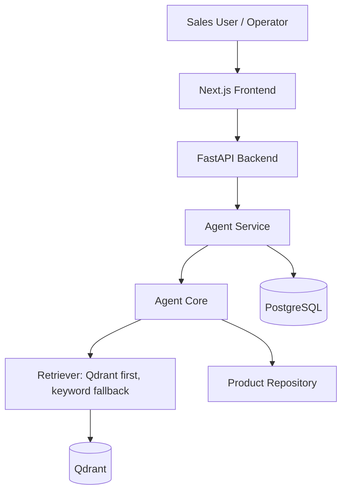

前端负责业务员工作台展示；后端负责 API、持久化和 Agent 调用；Agent Core 负责意图识别、品类判断、需求抽取、RAG、产品匹配、回复草稿和风险检查；Qdrant 负责知识库向量检索，失败时自动回退到 keyword retriever。

## 5. 技术栈 Tech Stack

- Frontend: Next.js, TypeScript, Tailwind CSS, App Router
- Backend: FastAPI, Pydantic, SQLAlchemy
- Database: PostgreSQL, SQLite fallback
- Vector DB: Qdrant
- Agent Core: rule fallback, optional LLM JSON extraction
- RAG: Markdown loader, heading splitter, hashing embedding, Qdrant retrieval, keyword fallback
- DevOps: Docker Compose, Dockerfile, healthcheck
- Testing: pytest, Next.js build

## 6. Agent 工作流 Agent Workflow

```mermaid
flowchart LR
    I["InquiryInput"] --> C["Intent Classifier"]
    C --> K["Product Category Classifier"]
    K --> E["Requirement Extractor"]
    E --> M["Missing Info Checker"]
    M --> R["Knowledge Retriever"]
    R --> P["Product Matcher"]
    P --> D["Reply Draft Generator"]
    D --> X["Risk Checker"]
    X --> O["Structured AgentResult"]
```

`Knowledge Retriever` 优先使用 Qdrant。若 Qdrant 未启动、collection 未创建或检索失败，会自动使用 keyword fallback，Agent 不会整体失败。

## 7. 数据流 Data Flow

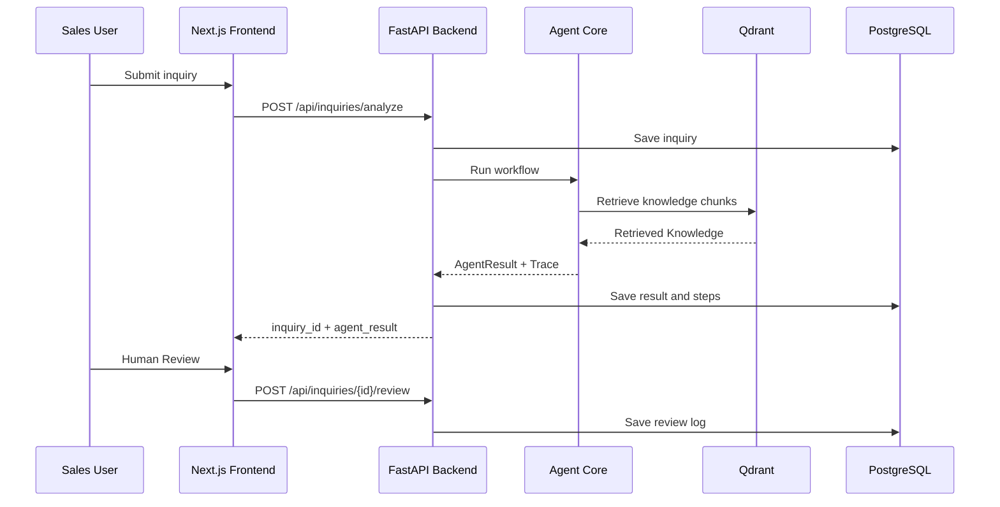

## 8. 截图 Screenshots

截图清单见 [docs/screenshots/README.md](docs/screenshots/README.md)。

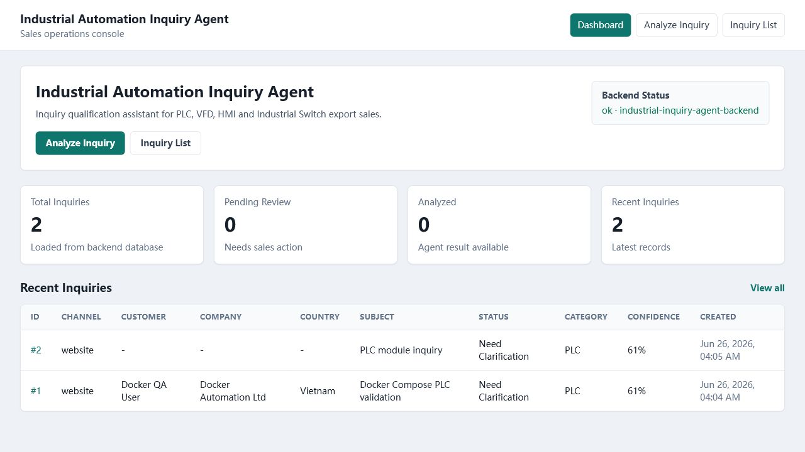
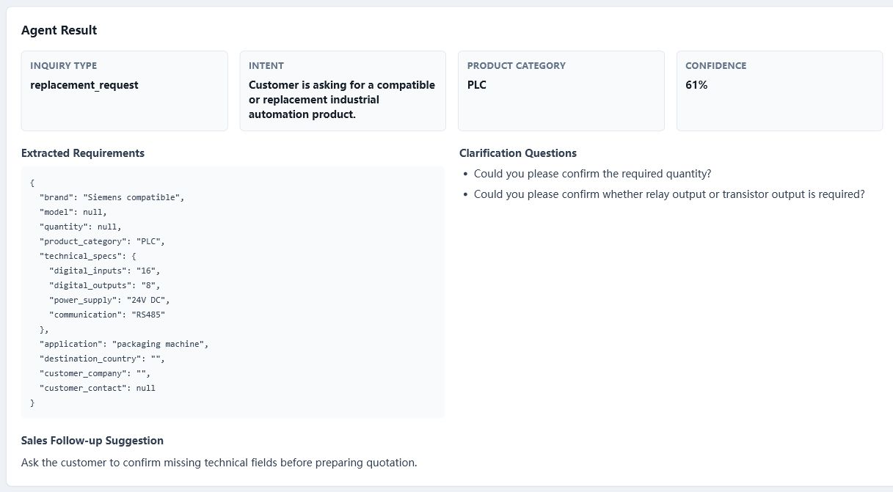
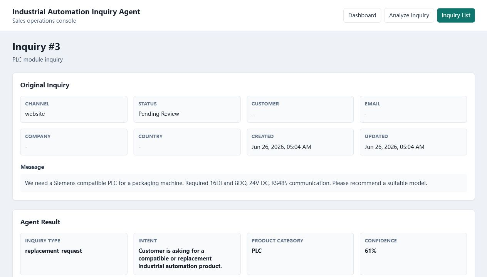
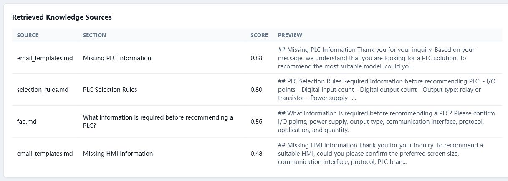
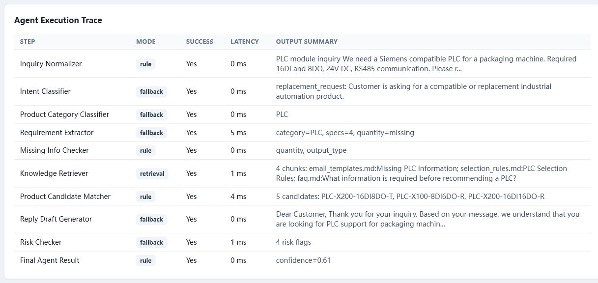
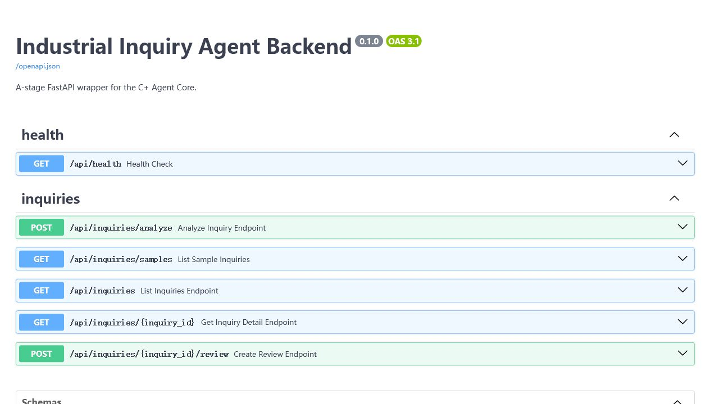
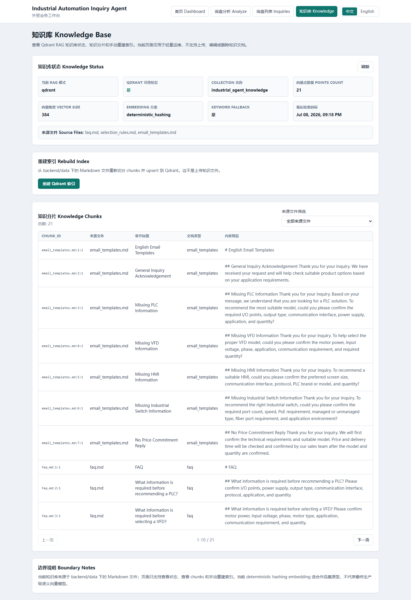
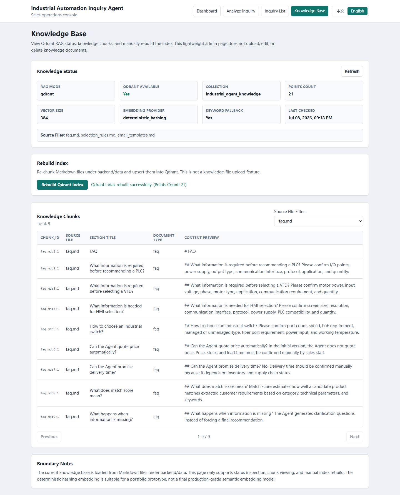

## 9. Docker Compose 快速启动 Quick Start

```bash
docker-compose up --build
```

访问地址：

```text
Frontend: http://127.0.0.1:3001
Backend API: http://127.0.0.1:8000
Swagger: http://127.0.0.1:8000/docs
PostgreSQL: localhost:5432
Qdrant: http://127.0.0.1:6333
```

构建 Qdrant 知识库索引：

```bash
docker-compose exec backend python scripts/build_qdrant_index.py
```

停止服务：

```bash
docker-compose down
```

清空数据库和 Qdrant volume：

```bash
docker-compose down -v
```

## 10. 本地开发 Local Development

Backend:

```bash
cd backend
python -m uvicorn app.main:app --reload --port 8000
```

Frontend:

```bash
cd frontend
npm install
npm run dev -- -H 127.0.0.1 -p 3001
```

Backend tests:

```bash
cd backend
PYTHONPATH=. python -m pytest
```

Frontend build:

```bash
cd frontend
npm run build
```

本地 Qdrant URL 可配置为：

```env
QDRANT_URL=http://127.0.0.1:6333
```

## 11. API 概览 API Overview

- `GET /api/health`
- `POST /api/inquiries/analyze`
- `GET /api/inquiries`
- `GET /api/inquiries/{id}`
- `POST /api/inquiries/{id}/review`
- `GET /api/inquiries/samples`
- `GET /api/knowledge/status`
- `GET /api/knowledge/chunks`
- `POST /api/knowledge/reindex`

详细说明见 [docs/api_overview.md](docs/api_overview.md)。

## 12. 演示流程 Demo Workflow

推荐演示流程：

1. 启动 Docker Compose。
2. 执行 Qdrant index build。
3. 打开 `http://127.0.0.1:3001`。
4. 进入 Analyze Inquiry。
5. 加载 PLC 或 VFD sample。
6. 提交分析并展示 AgentResult。
7. 展示 Candidate Products、Missing Information、Retrieved Knowledge、Agent Trace。
8. 进入 Knowledge Base 页面，查看 Qdrant status、chunks 和手动 rebuild index。
9. 进入 Inquiry Detail。
10. 编辑 English Reply Draft。
11. 提交 Human Review。
12. 说明 PostgreSQL 和 Qdrant 持久化。

## 13. 原型边界 Prototype Boundary

当前项目是工程化原型，不是生产销售自动化系统。

- 当前产品数据为高仿真模拟数据。
- 当前 hashing embedding 是 prototype lightweight embedding，不代表最终生产语义 embedding。
- 当前 Qdrant RAG 已具备工程接口，但可继续升级为 OpenAI embeddings 或 sentence-transformers。
- 当前 Knowledge Base Admin 只支持查看状态、查看 chunks 和手动重建索引，不支持上传、编辑或删除知识文档。
- 系统不自动报价。
- 系统不承诺库存。
- 系统不承诺交期。
- 系统不自动发送邮件。
- 英文回复草稿必须由业务员人工审核。
- 登录权限、CRM、ERP、邮件系统、Redis、报价系统尚未接入。
- 当前评估不代表真实生产准确率。

## 14. 路线图 Roadmap

- A7.5 可继续增强 Knowledge Base Admin，例如查看 collection diagnostics 和更细粒度 rebuild 日志。
- 生产级 embedding：OpenAI embeddings 或 sentence-transformers。
- Alembic 数据库迁移。
- Redis 异步任务队列。
- 登录权限与角色控制。
- CRM / ERP / 邮件系统集成。
- 带人工审批接口的报价准备流程。

## 15. 简历亮点 Resume Highlights

- 构建面向 B2B 工业自动化外贸询盘的 full-stack AI Agent 应用。
- 设计结构化 Agent workflow：fallback extraction、Qdrant RAG、product matching、risk checking、Agent Trace。
- 实现 FastAPI API、PostgreSQL 持久化、Next.js 前端后台、Qdrant 向量检索和 Docker Compose 部署。
- 采用 Human-in-the-loop 设计，避免自动报价、库存承诺、交期承诺和自动邮件发送等高风险行为。

英文简历 bullet points 保留在 [docs/resume_description.md](docs/resume_description.md)。
## 16. A8 权限与角色 Auth & Role-Based Access

A8 在现有后台基础上新增轻量 demo 权限系统，让项目更接近企业内部业务后台骨架：

- 新增 `/login` 页面，支持中文 / English 切换。
- 新增 `POST /api/auth/login`、`GET /api/auth/me`、`POST /api/auth/logout`。
- 提供 demo 用户：`admin@example.com / admin123`、`sales@example.com / sales123`、`support@example.com / support123`。
- 前端顶部显示当前用户与角色，并支持退出登录。
- `Knowledge Base Admin` / `/knowledge` 仅 admin 可访问；sales / support 会看到无权限提示。
- Review 提交时如果用户已登录，后端会记录当前登录用户。

边界说明：A8 是 portfolio / prototype 级 demo auth，不是完整企业 SSO / OAuth / 多租户账号系统；没有接入真实企业用户、短信验证码、密码找回或字段级权限。
