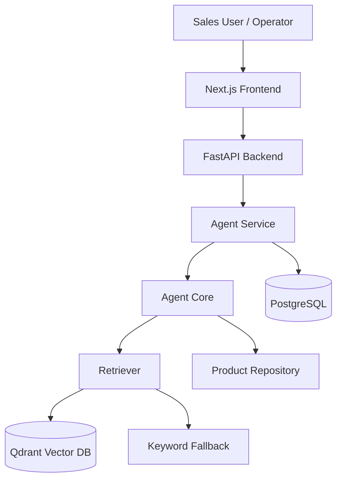
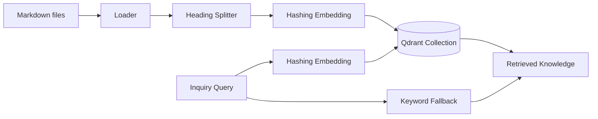
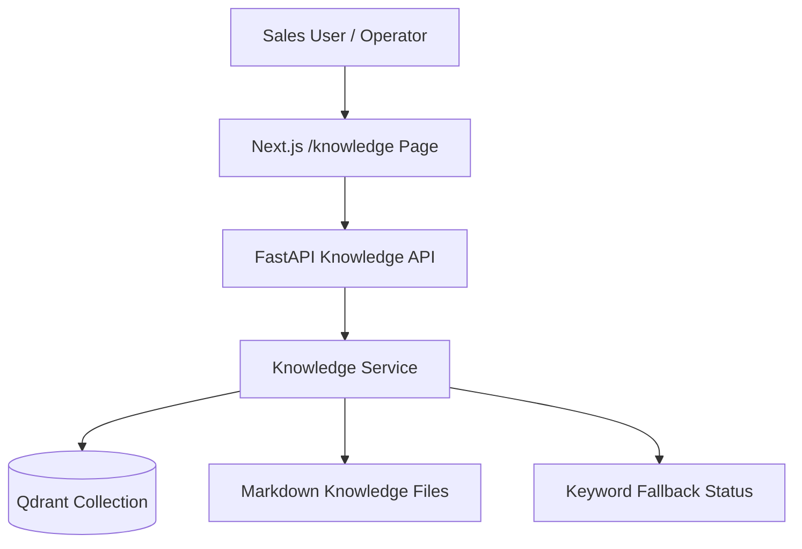
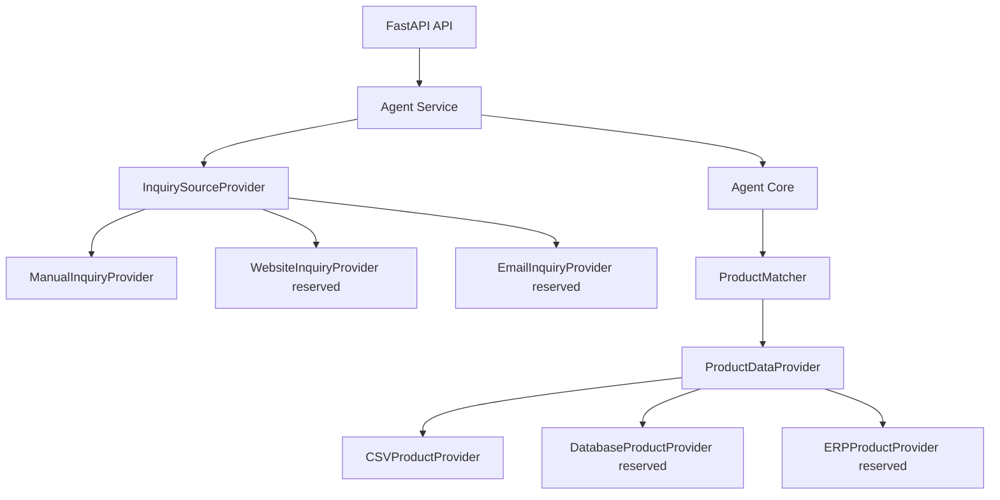
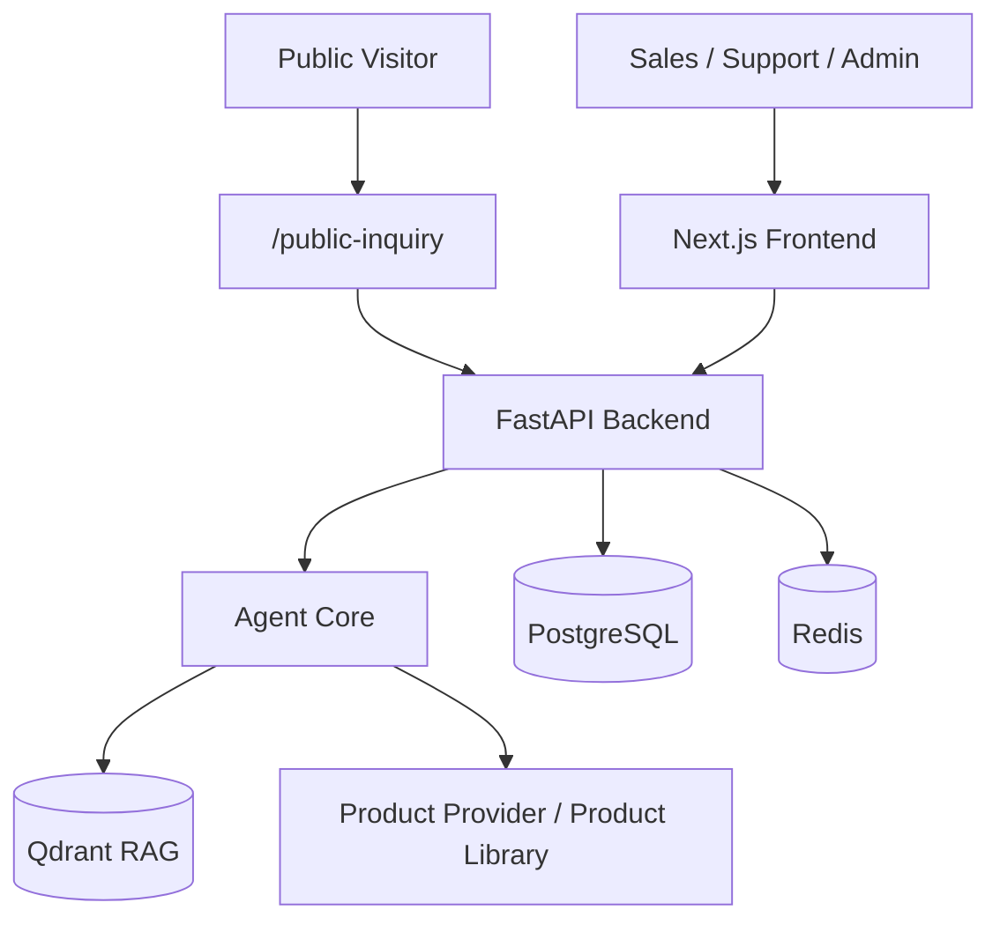

# 系统架构 Architecture

## 1. 当前系统架构



系统由五个核心部分组成：

- Frontend：业务员工作台，展示 Dashboard、Analyze、Inquiry List、Inquiry Detail、Human Review。
- Backend：FastAPI REST API，负责请求校验、Agent 调用、数据库持久化。
- Agent Core：询盘分析核心，包含 intent、category、requirement extraction、retrieval、matching、reply draft、risk check。
- PostgreSQL：保存 inquiry、AgentResult、AgentRun、AgentStep、ReviewLog。
- Qdrant：保存 Markdown 知识库 chunks 的向量索引，用于 `Retrieved Knowledge`。

## 2. C+ 原型到 A 阶段工程化演进

C+ 阶段使用 Streamlit 验证最小闭环：规则 fallback、可选 LLM JSON 抽取、轻量 RAG、结构化 AgentResult、Agent Trace。

A 阶段工程化演进：

- A1：FastAPI 封装 Agent Core。
- A2：SQLite fallback / PostgreSQL 持久化。
- A3：Next.js 客服 / 业务员后台 MVP。
- A4：Docker Compose 一键启动链路。
- A5：README、docs、截图和录屏素材整理。
- A5.6：中文 / English UI 切换和中文文档本地化。
- A6：Qdrant-based Vector Retrieval + Keyword Fallback。

## 3. RAG 架构



当前知识库来源：

- `backend/data/faq.md`
- `backend/data/selection_rules.md`
- `backend/data/email_templates.md`

每个 chunk payload 保留：

- `content`
- `source_file`
- `section_title`
- `document_type`
- `chunk_id`

`retrieved_knowledge` 返回结构保持兼容：

```json
{
  "content": "...",
  "score": 0.91,
  "metadata": {
    "source_file": "selection_rules.md",
    "section_title": "PLC Selection",
    "document_type": "selection_rules",
    "chunk_id": "selection_rules.md:1:1"
  }
}
```

## 4. Docker Compose 服务

当前 Compose 启动：

- `postgres`: PostgreSQL 数据库。
- `qdrant`: Qdrant vector database。
- `backend`: FastAPI backend，连接 PostgreSQL 和 Qdrant。
- `frontend`: Next.js frontend，访问宿主机暴露的 backend API。

访问地址：

```text
Frontend: http://127.0.0.1:3001
Backend API: http://127.0.0.1:8000
Swagger: http://127.0.0.1:8000/docs
Qdrant: http://127.0.0.1:6333
```

构建 Qdrant 索引：

```bash
docker-compose exec backend python scripts/build_qdrant_index.py
```

## 5. Human-in-the-loop 设计

系统只生成英文回复草稿，不自动发送邮件。业务员必须人工审核：

- 检查候选产品是否合适。
- 确认缺失参数。
- 检查价格、库存、交期风险。
- 修改 `English Reply Draft`。
- 提交 `review_status` 和 `reviewer_note`。

## 6. 风险控制边界

系统明确不做：

- 自动报价。
- 库存承诺。
- 交期承诺。
- 自动发送邮件。
- 虚构品牌授权、认证或兼容性。

这些边界通过 prompt guardrails、reply template、risk checker 和 Human Review 流程共同控制。

## 7. 后续替换点

当前 hashing embedding 是本地 deterministic prototype embedding，优点是无 API Key、无模型下载依赖。后续可升级：

- OpenAI embeddings。
- sentence-transformers。
- 更细粒度 chunking。
- 知识库管理后台。
- 索引增量更新。

## 8. A7 Knowledge Base Admin 架构补充

A7 在不改动 Agent Core 和数据库主模型的前提下，新增轻量知识库运维后台：



新增 API：

- `GET /api/knowledge/status`: 查看 RAG mode、Qdrant availability、collection、points_count、embedding provider 和 keyword fallback。
- `GET /api/knowledge/chunks`: 从 Qdrant scroll payload 读取 chunks，支持 `source_file`、`limit`、`offset`。
- `POST /api/knowledge/reindex`: 复用 Markdown loader、splitter、hashing embedding 和 Qdrant upsert 逻辑重建索引。

该页面只用于轻量运维展示，不支持上传、编辑、删除知识文档，也不引入登录、Redis、邮件、CRM/ERP 或报价系统。
## A9 数据适配层 Business Data Adapter Layer

A9 在 Agent Core 与模拟数据之间增加 provider 抽象：



当前默认仍是 `CSVProductProvider` + `ManualInquiryProvider`。`DatabaseProductProvider` 和 `ERPProductProvider` 只是未来接入 PostgreSQL 产品表、SAP / 金蝶 / 用友 / 内部 ERP 的接口骨架，不代表已经接入真实企业数据。
## A-Final 客服/业务员后台最终集成版

A-Final 已补齐客服/业务员后台闭环：Public Website Inquiry、Email Inquiry Import、Inquiry Console、Requirement Confirmation Card、Candidate Products、Reply Draft edit/copy/export、Human Review、Follow-up Status、Product Library Admin、Knowledge Upload、Qdrant Rebuild Index、Redis basic status integration。

当前边界保持不变：No automatic quotation, no stock commitment, no delivery commitment, no automatic email sending, manual review required。当前产品数据和知识库数据仍为高仿真模拟数据；项目定位仍是 portfolio / prototype 工程化项目，不代表完整生产系统。

## A-Final 架构补充

A-Final 之后，系统形成五服务 Docker Compose 架构：



- `frontend`：客服 / 业务员后台、Public Inquiry、Product Library Admin、Knowledge Base Admin。
- `backend`：FastAPI API、Agent Service、Auth、Review、Product Library、Knowledge Upload、System Status。
- `postgres`：询盘、AgentResult、AgentStep、ReviewLog、产品库 demo 数据等持久化。
- `qdrant`：Markdown knowledge chunks 向量检索。
- `redis`：基础 availability / system status 接入，后续可扩展缓存、限流或后台任务状态。

A-Final 不改变核心业务边界：No automatic quotation, no stock commitment, no delivery commitment, no automatic email sending, manual review required。
