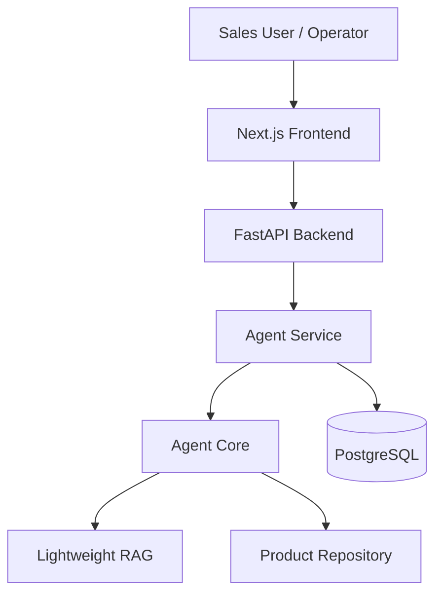
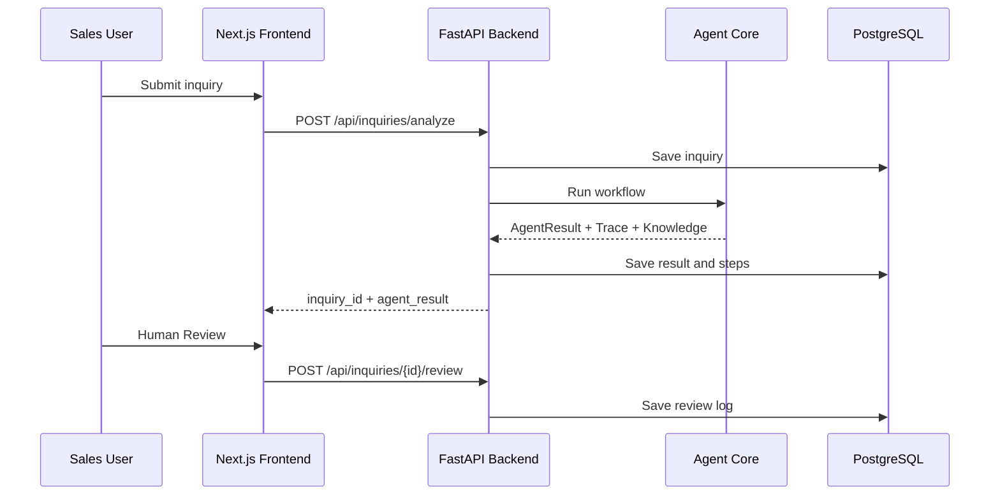

# 系统架构 Architecture

## 1. 当前架构



系统由四层组成：

- Frontend：业务员工作台，展示 Dashboard、Analyze、Inquiry List、Inquiry Detail、Human Review。
- Backend：FastAPI REST API，负责请求校验、Agent 调用、数据库持久化。
- Agent Core：询盘分析核心，包括 intent、category、requirement extraction、retrieval、matching、reply draft、risk check。
- Database：PostgreSQL，保存询盘、AgentResult、AgentRun、AgentStep、ReviewLog。

## 2. C+ 原型到 A 阶段演进

C+ 阶段使用 Streamlit 做最小可运行 Demo，验证：

- 规则 fallback。
- 可选 LLM JSON 抽取。
- 轻量 RAG。
- AgentResult 结构化输出。
- Agent Trace。

A 阶段将 C+ Agent Core 工程化：

- A1: FastAPI 封装 Agent Core。
- A2: PostgreSQL / SQLite 持久化。
- A3: Next.js 客服 / 业务员后台。
- A4: Docker Compose 一键启动链路。
- A5: README/docs 项目包装。
- A5.5: 实际截图和录屏素材整理。
- A5.6: 中英文 UI 切换与中文文档本地化。

## 3. 数据流 Data Flow



## 4. Docker Compose 服务

当前 Compose 启动：

- `postgres`: PostgreSQL 数据库。
- `backend`: FastAPI backend，默认连接 PostgreSQL。
- `frontend`: Next.js frontend，宿主机访问 `http://127.0.0.1:3001`。

访问地址：

```text
Frontend: http://127.0.0.1:3001
Backend API: http://127.0.0.1:8000
Swagger: http://127.0.0.1:8000/docs
```

## 5. RAG 当前边界与 Qdrant 替换点

当前 RAG 是轻量关键词检索：

- 从 `faq.md`、`selection_rules.md`、`email_templates.md` 加载知识。
- 按 Markdown heading 切 chunk。
- 保留 metadata：`source_file`、`section_title`、`chunk_id`、`document_type`。
- 使用关键词评分返回 top results。

A6 建议替换为 Qdrant：

- Markdown chunk 写入 Qdrant。
- 增加 embedding 层。
- Retriever 接口支持 Qdrant 检索。
- 保留 keyword fallback。
- 保持前端 Retrieved Knowledge 结构不变。

## 6. Human-in-the-loop 设计

系统只生成英文回复草稿，不自动发送邮件。业务员必须人工审核：

- 检查候选产品是否合适。
- 确认缺失参数。
- 检查价格、库存、交期风险。
- 决定 review_status。
- 必要时修改 English Reply Draft。

## 7. 风险控制边界

系统明确不做：

- 自动报价。
- 库存承诺。
- 交期承诺。
- 自动发送邮件。
- 虚构品牌授权、认证或兼容性。

这些边界通过 reply draft 文案、risk checker 和 Human Review 流程共同控制。
