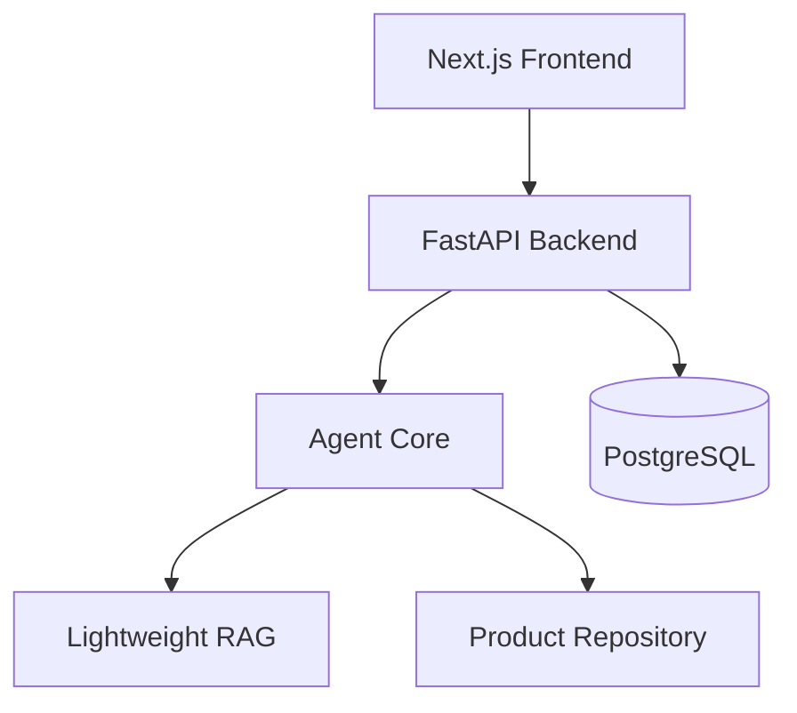

# Interview Guide

## 30-Second Introduction

This is a full-stack AI Agent application for industrial automation export inquiry qualification. It helps sales users analyze customer inquiries for PLC, VFD, HMI, and Industrial Switch products. The system extracts structured requirements, retrieves knowledge sources, recommends candidate products, drafts an English reply, and records human review decisions. It uses Next.js, FastAPI, PostgreSQL, Docker Compose, lightweight RAG, fallback rules, and Agent Trace observability.

## 2-Minute Introduction

The project started as a C+ prototype to validate the Agent workflow before building a more engineered A-stage system. The current version has a Next.js sales console, FastAPI backend, PostgreSQL persistence, Docker Compose startup, and a reusable Agent Core.

The Agent workflow classifies intent and product category, extracts technical requirements, checks missing information, retrieves knowledge from Markdown files, matches candidate products from a repository, drafts an English reply, and checks business risks. Every step returns structured data and writes execution trace records. The frontend displays the AgentResult, retrieved knowledge, candidate products, risk flags, and trace. A sales user can edit the reply draft and submit a human review status.

The product intentionally does not quote price, promise stock, promise lead time, or send emails automatically. This is because industrial automation sales involve technical compatibility, inventory uncertainty, and commercial risk.

## Technical Architecture

The backend is the orchestration boundary. API routes are thin and delegate business work to services. The Agent Core is separated from repositories and retrievers so product data and RAG storage can evolve independently.

## Agent Workflow Explanation

The workflow turns unstructured text into a structured `AgentResult`:

1. Intent classification.
2. Product category detection.
3. Requirement extraction.
4. Missing information check.
5. Knowledge retrieval.
6. Product candidate matching.
7. Reply draft generation.
8. Risk checking.
9. Trace and persistence.

If LLM JSON extraction is disabled or fails, the system falls back to deterministic rules.

## Why Not Automatic Quotation?

In industrial automation export sales, price depends on model confirmation, quantity, region, availability, supplier policy, and margin rules. Automatic quotation can create commercial and legal risk. The system only prepares structured context and a reply draft for human review.

## Why Human-In-The-Loop?

Human review is required because:

- Technical parameters may be incomplete.
- Brand compatibility may need verification.
- Stock and lead time can change.
- Certifications and authorization claims must be checked.
- Final customer communication should be controlled by the sales team.

## Why C+ Prototype Before A-Stage Engineering?

The C+ prototype validated the workflow quickly with Streamlit, Pydantic schemas, fallback logic, product repository, lightweight RAG, trace, and demo exports. After validating the workflow, the A-stage system added FastAPI, PostgreSQL, Next.js, and Docker Compose. This reduced the risk of over-engineering before the Agent behavior was clear.

## Lightweight RAG Boundary

The current RAG is keyword-based over Markdown chunks. It is transparent and easy to demo, but not enough for production semantic retrieval. It does not support embeddings, hybrid search, reranking, or large-scale document management.

## How To Upgrade To Qdrant

Keep the retriever interface stable and replace the current lightweight retriever with:

- Embedding model.
- Qdrant collection.
- Chunk ingestion pipeline.
- Metadata filtering.
- Top-k semantic retrieval.
- Optional reranking.

The Agent Core should continue calling the same retriever interface.

## Q: How Is This Different From A Normal Chatbot?

A normal chatbot usually produces a conversation response. This system produces a structured, auditable business workflow result. It extracts fields, records missing information, retrieves sources, recommends products from a repository, produces trace logs, persists records, and requires human review.

## Q: What If The LLM Makes A Mistake?

The system has several safeguards:

- Rule fallback if LLM is unavailable or returns invalid JSON.
- Pydantic schemas for structured validation.
- Candidate products must come from the product repository.
- Risk checker flags unsafe claims.
- Human review is mandatory before customer communication.
- Agent Trace helps diagnose which step caused the issue.

## Q: How Would You Productionize It?

Recommended production path:

- Add authentication and role-based access control.
- Add Alembic migrations.
- Replace lightweight RAG with Qdrant.
- Add Redis and background jobs for long-running workflows.
- Integrate CRM/ERP/email systems with approval gates.
- Add observability: structured logs, metrics, tracing, audit logs.
- Add test coverage for more real inquiry patterns.
- Add deployment pipeline and environment-specific configuration.
