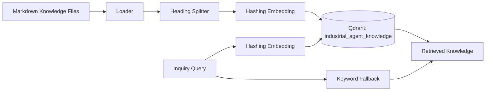

# Qdrant RAG 总结 Qdrant RAG Summary

## 1. 背景 Background

A6 之前，项目使用 lightweight keyword-based RAG：从 Markdown 知识库加载 `faq.md`、`selection_rules.md`、`email_templates.md`，按 heading 切分 chunk，再用关键词匹配计算 score。这种方式适合 C+ 原型和早期演示，但语义检索能力有限，也不利于后续扩展到更大的知识库。

## 2. A6 目标

A6 的目标是将轻量关键词检索升级为：

```text
Qdrant-based Vector Retrieval + Keyword Fallback
```

具体目标：

- Docker Compose 增加 Qdrant 服务。
- Markdown knowledge chunks 写入 Qdrant collection。
- 增加独立 embedding 层。
- Retriever 优先使用 Qdrant。
- Qdrant 不可用时自动 fallback 到 keyword retriever。
- 保持 `retrieved_knowledge` 返回结构不变。
- 不影响前端 `Retrieved Knowledge` 展示。

## 3. 改造前后对比

| Item | Before A6 | After A6 |
| --- | --- | --- |
| RAG backend | Keyword retriever | Qdrant vector retrieval + keyword fallback |
| Index storage | In-memory chunks | Qdrant collection |
| Embedding | None | Deterministic hashing embedding |
| Fallback | Keyword only | Qdrant first, keyword fallback |
| Frontend structure | `retrieved_knowledge` | unchanged |
| Trace mode | `retrieval` | `qdrant` or `keyword_fallback` |

## 4. Qdrant RAG 架构



当前 collection：

```text
industrial_agent_knowledge
```

当前已写入 chunks：

```text
21
```

## 5. Embedding 方案

当前使用 deterministic hashing embedding：

- 本地运行。
- 默认 384 维。
- L2 normalize。
- 无 API Key。
- 无外部模型下载。
- 输出稳定，同一文本得到同一向量。
- 属于 prototype lightweight embedding，不代表最终生产语义 embedding。

后续可升级：

- OpenAI embeddings。
- sentence-transformers。
- bge-small / bge-m3 等中文或多语向量模型。

## 6. Index Build 流程

索引构建命令：

```powershell
docker-compose exec backend python scripts/build_qdrant_index.py
```

流程：

1. 读取 Markdown 文件。
2. 按 heading 切分为 chunks。
3. 为每个 chunk 生成 hashing embedding。
4. 创建或复用 Qdrant collection。
5. 使用稳定 UUID upsert points。
6. payload 保存 `content` 和 metadata。

payload 字段：

- `content`
- `source_file`
- `section_title`
- `document_type`
- `chunk_id`

重复执行 index build 不会堆叠重复 points；当前验证中 `points_count` 保持为 `21`。

## 7. Retrieval 流程

Agent 在 `Knowledge Retriever` 节点中构建 query，Retriever 读取配置：

- `ENABLE_QDRANT_RAG=true`
- `RAG_RETRIEVAL_MODE=qdrant`
- `QDRANT_URL=http://qdrant:6333`
- `QDRANT_COLLECTION=industrial_agent_knowledge`

当 Qdrant 可用时：

1. 将 query 转为 hashing embedding。
2. 调用 Qdrant search。
3. 将结果转换为兼容的 `retrieved_knowledge` 结构。
4. Agent Trace 记录 `mode=qdrant`。

当前实现还加入了 lightweight lexical re-rank，让 prototype 检索结果在小语料中更稳定。

## 8. Keyword Fallback 机制

如果出现以下情况，会自动 fallback：

- Qdrant 服务未启动。
- Qdrant URL 不可访问。
- collection 未创建。
- Qdrant search 失败。
- Qdrant 返回空结果。

fallback 后：

- 使用原有 keyword retriever。
- Agent 不整体失败。
- `retrieved_knowledge` 结构保持不变。
- Agent Trace 记录 `mode=keyword_fallback`。

## 9. Agent Trace 可观测性

A6 后 `Knowledge Retriever` 的 trace mode 可显示：

- `qdrant`: 使用 Qdrant 检索。
- `keyword_fallback`: Qdrant 不可用，回退 keyword retriever。
- `retrieval`: 未启用 Qdrant 时的普通检索。

这让演示和排查时可以直接判断本次 Agent 是否真正使用了 Qdrant。

## 10. 前端兼容性

A6 没有修改前端 `Retrieved Knowledge` 的数据结构。前端仍然读取：

```json
{
  "content": "...",
  "score": 0.0,
  "metadata": {
    "source_file": "...",
    "section_title": "...",
    "document_type": "...",
    "chunk_id": "..."
  }
}
```

因此 A6 后前端无需大改版，仍可展示 source_file、section_title、score 和 content preview。

## 11. 测试与验证结果

A6.5 回归验证结果：

- Docker Compose includes Qdrant: PASS。
- Qdrant endpoint `http://127.0.0.1:6333`: PASS。
- Collection `industrial_agent_knowledge`: PASS。
- Chunks indexed: `21`。
- Qdrant `points_count`: `21`。
- `/api/inquiries/analyze`: PASS。
- Agent Trace shows `Knowledge Retriever=qdrant`: PASS。
- Keyword fallback unit test: PASS。
- Backend pytest: `14 passed`。
- Frontend build: PASS。
- Review API: PASS。

## 12. 当前边界

- 当前产品数据为高仿真模拟数据。
- 当前 hashing embedding 是 prototype lightweight embedding。
- 当前不是完整生产级 RAG，不包含知识库上传后台、权限系统、增量索引管理和生产级 embedding 服务。
- 不自动报价。
- 不承诺库存。
- 不承诺交期。
- 不自动发送邮件。
- English Reply Draft 必须由业务员人工审核。

## 13. 后续可扩展方向

- 增加 Knowledge Base Admin，用于查看 chunks 和手动重建 Qdrant index。
- 接入 OpenAI embeddings 或 sentence-transformers。
- 支持 bge-small / bge-m3 等中文或多语向量模型。
- 增加知识库版本、索引状态、索引任务日志。
- 用 Redis / background jobs 管理耗时索引构建。
- 增加更完整的检索评估集和 recall / precision 指标。
